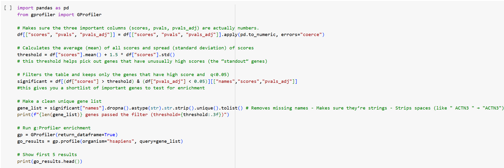
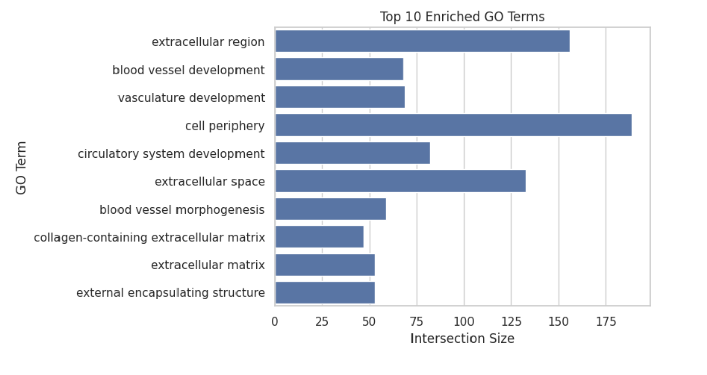
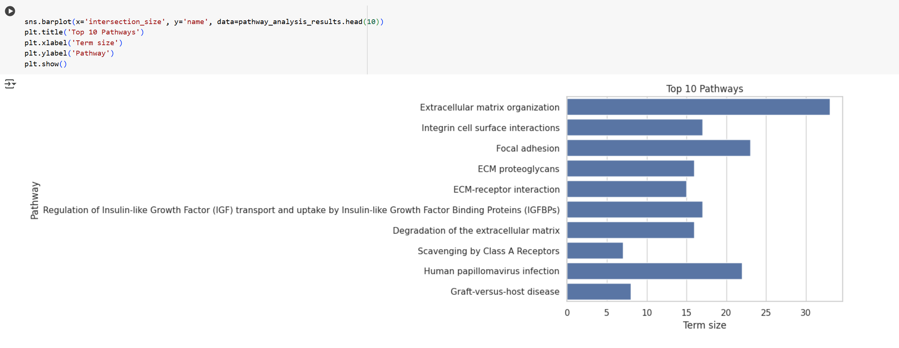

# *Functional Enrichment Analysis of Skeletal Muscle*

# Introduction
RNA sequencing is a powerful tool for studying skeletal muscle biology, revealing changes in gene expression after exercise, injury, or disease. To make sense of these large datasets, researchers rely on functional enrichment analysis, which includes,
- Gene Ontology (GO) analysis - mapping genes to biological processes, cellular components, and molecular functions.
- Pathway analysis - identifying signaling/metabolic pathways (KEGG, Reactome).
- Gene Set Enrichment Analysis (GSEA) - testing if predefined gene sets show coordinated expression shifts.

In this project, I applied these approaches to a skeletal muscle dataset to uncover genes, processes, and pathways involved in vascular remodeling and extracellular matrix biology.

## Dataset
- File- `data/skeletal_muscle.csv`
- Columns -
  - `names` — gene symbol
  - `scores` — Wilcoxon rank-sum test statistic (positive = up-regulated post-exercise)
  - `pvals` — raw p-value
  - `pvals_adj` — FDR-adjusted p-value

# Gene Ontology (GO) Analysis

##What is GO Analysis?
Differentially expressed genes are categorized by GO into biological processes (BP), cellular components (CC), and molecular functions (MF). This reveals the biological context of gene expression changes.

# Results in Skeletal Muscle
- Extracellular region 
- Cell periphery 
- Blood vessel development 
- Circulatory system development 

Interpretation - Genes are strongly enriched in vascular growth and extracellular matrix activity, consistent with exercise-induced remodeling of skeletal muscle.

# *Pathway Analysis*

# What is Pathway Analysis?
Pathway analysis maps genes to known signaling or metabolic pathways (KEGG/Reactome), providing insight into system-level changes.

# Results in Skeletal Muscle
- Regulation of IGF transport and uptake
- Extracellular matrix–receptor interaction
- Immune-related signaling cascades
Interpretation - Muscle adaptation is largely dependent on ECM remodeling and growth factor signaling.

# Gene Set Enrichment Analysis (GSEA)

# What is GSEA?

Using GSEA, we can find out if certain genes are enriched at the top (upregulated) or bottom (downregulated) of a gene list. Unlike GO/Pathway analysis, it doesn’t require prior filtering.

# Results in Skeletal Muscle

- PI3K–Akt signaling pathway highly enriched - regulates growth, survival, and metabolism.
- mTOR signaling pathway enriched - controls protein synthesis and hypertrophy.

Interpretation - Growth and adaptation pathways get activated when you train.

# Integrated Conclusion

Together, the analyses show - 
- The extracellular matrix is strongly enriched in this cell type and vascular development is strongly enhanced.
- IGF, PI3K-Akt, and mTOR signaling pathways are involved in the regulation of this process.
- There is evidence that muscles undergo remodeling and adaptation in response to physiological stimuli.

## How to Run

### Google Colab
1. Open `functional_enrichment_analysis.ipynb` in Colab.
2. Upload `data/skeletal_muscle.csv` to the Colab workspace (or mount Drive).
3. Run all cells. Figures are saved to `figures/`, tables to `results/`.

  

